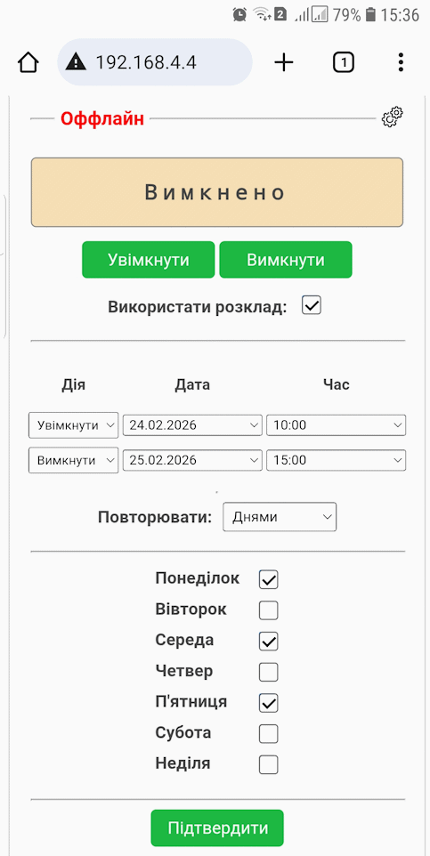

# ESP8266 Relay Scheduler

This is a simple web-based relay controller firmware for ESP8266 (tested on ESP-01 1M).  
It lets you control a relay over WiFi, set up schedules, and manage settings via a nice web interface (Ukrainian language).

## Features

- **Web UI**: Controls the relay from your browser (mobile-friendly).
- **Scheduling**: Sets up actions (on/off) by date, time, and repeat (once, daily, weekly, monthly, or by days of the week).
- **WiFi Setup**: Supports both DHCP and static IP.
- **Authentication**: Optional login/password protection for the web UI.
- **NTP Time Sync**: Keeps time accurate using NTP servers.
- **Offline Mode**: If WiFi fails, the device starts its own AP for configuration.
- **LittleFS**: Stores settings and schedules in the ESP8266’s flash.

## Screenshot



## Getting Started

### Hardware

- ESP8266 board (ESP-01 1M or similar)
- Relay module
- USB-to-Serial adapter for flashing

### Flashing

1. **Install [PlatformIO](https://platformio.org/)**
2. Clone this repo:
    ```sh
    git clone https://github.com/itmaster-biz-ua/esp8266-relay-firmware.git
    cd esp8266-relay-firmware
    ```
3. **Connect your ESP8266** and put it in flash mode.
4. **Build and upload:**
    ```sh
    pio run --target upload
    ```
5. **Upload the web UI files:**
    ```sh
    pio run --target uploadfs
    ```

### First Run

- On first boot, the device will try to connect to your WiFi (set in `data/settings.json`).
- If it fails, it will start an AP called `SmartRelay` (default IP: 192.168.4.4).
- Open the web UI in your browser and configure your WiFi and other settings.

## Web Interface

- **Main page**: Toggle relay, see status, and set schedules.
- **Settings page**: WiFi, authentication, timezone, and static IP options.

## File Structure

- `src/` – Main firmware code
- `lib/` – Project libraries (schedule, settings)
- `data/` – Web UI files (HTML, JS, CSS, images)
- `platformio.ini` – PlatformIO config

